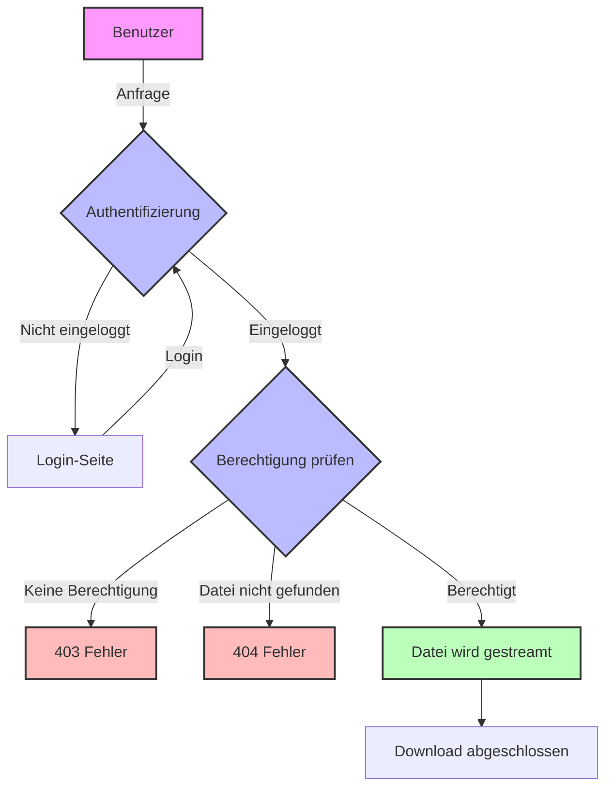

# Ablauf eines Dateiabrufs

## Prozessdiagramm

## Erklärung der Schritte

1. **Anfrage**
   - Benutzer fordert geschützte Datei an

2. **Authentifizierung**
   - Prüfung ob Benutzer eingeloggt ist
   - Bei nicht eingeloggten Benutzern: Weiterleitung zum Login

3. **Berechtigungsprüfung**
   - Prüfung der Benutzerrolle
   - Validierung des Dateipfads
   - Sicherheitsüberprüfungen

4. **Ergebnis**
   - Erfolg: Datei wird gestreamt
   - Fehler: 403 (keine Berechtigung) oder 404 (Datei nicht gefunden)

## Sicherheitsaspekte

- Keine direkte URL-Zugänglichkeit
- Rollenbasierte Zugriffskontrolle
- Pfadvalidierung gegen Directory Traversal
- Sichere Dateiübertragung
- Keine PHP-Ausführung in geschützten Verzeichnissen 