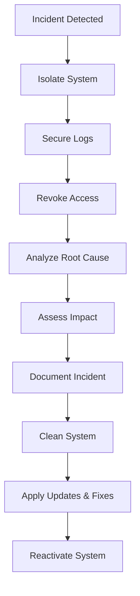

# Security Policies

This document outlines the security measures and best practices for protecting files.

## Objectives of Security Measures

The following measures aim to prevent:

* Unauthorized access to protected files
* Bypassing user roles and access restrictions
* Directory traversal attacks and direct file access
* Abuse by automated tools or mass access (DoS)
* Application-layer vulnerabilities (e.g., XSS, CSRF)
* Violations of data protection regulations (e.g., GDPR)

## Security Architecture

### Layered Security

1. **File System Level**

   * Files stored outside the WebRoot
   * Strict permissions
   * No direct URL accessibility

2. **Web Server Level**

   * `.htaccess` protection
   * PHP execution disabled
   * Redirects to `check-access.php`

3. **Application Level**

   * WordPress authentication
   * Role-based access control
   * Session management
   * XSS protection (escape HTML output)
   * CSRF protection in forms (e.g., token usage)

4. **Transport Layer**

   * HTTPS encryption
   * Secure cookies
   * Chunked downloads

## Security Measures

### File System Security

1. **Folder Structure**

   ```
   /secure-files/              # Main directory (755)
   ├── config/                # Configuration folder (755)
   │   └── secure-config.php  # Configuration file (644)
   └── [role-folders]/        # Role-specific folders (755)
   ```

2. **Permissions**

   * Folders: 755 (drwxr-xr-x)
   * Files: 644 (-rw-r--r--)
   * Executable files: 755 (-rwxr-xr-x)

3. **Protection Measures**

   * No PHP execution
   * No directory listing
   * No direct downloads

### Web Server Security

1. **.htaccess Rules**

   ```apache
   # Disable PHP execution
   <FilesMatch "\.php$">
       Order Allow,Deny
       Deny from all
   </FilesMatch>

   # Disable directory listing
   Options -Indexes

   # Redirect to check-access.php
   RewriteEngine On
   RewriteCond %{REQUEST_FILENAME} -f
   RewriteRule ^(.*)$ check-access.php?file=$1 [L,QSA]
   ```

2. **PHP Configuration**

   * `display_errors = Off`
   * `log_errors = On`
   * `error_reporting = E_ALL`

3. **Rate Limiting and Abuse Protection (optional)**

   * IP-based request limits via middleware or web server (mod_evasive, Nginx limits)
   * Access counters per IP using session context or Redis

### Application Security

1. **Authentication**

   * WordPress login required
   * Strong password policies
   * Session timeouts

2. **Access Control**

   * Role-based permissions
   * Folder-based restrictions
   * No role escalation

3. **File Handling**

   * MIME type validation
   * File size restrictions
   * Chunked downloads

### Data Protection & Logging

* No storage of IP addresses or personal data without legal basis
* Log file access restricted to authorized administrators
* Automate deletion of old logs (e.g., after 30 days)

## Best Practices

### Configuration

1. **Secure Settings**

   ```php
   define('DEBUG_MODE', false);          // Disable debug mode
   define('CHUNK_SIZE', 4194304);        // 4 MB
   define('MAX_DIRECT_DOWNLOAD_SIZE', 1048576); // 1 MB
   ```

2. **MIME Types**

   * Define only allowed types
   * Exclude executable files (e.g., .php, .exe)
   * Use documented and verifiable formats

### Maintenance

1. **Regular Checks**

   * Review permissions
   * Analyze logs
   * Apply updates

2. **Backup Strategy**

   * Regular backups
   * Encrypted storage
   * Separate locations

3. **Monitoring**

   * Access logs
   * Error logs
   * Performance metrics

## Security Checklist

### Installation

* [ ] Folders located outside the WebRoot
* [ ] Correct permissions for files and directories
* [ ] No executable files in the download directory
* [ ] HTTPS fully configured
* [ ] Debug mode disabled
* [ ] Access only via `check-access.php`

### Configuration

* [ ] User roles correctly assigned
* [ ] Defined access structure per role
* [ ] MIME types restricted to safe formats
* [ ] Appropriate chunk size configured
* [ ] Download limits set (size and number)
* [ ] Security headers active
* [ ] PHP error output disabled

### Maintenance

* [ ] Regular updates of WordPress, PHP, and plugins
* [ ] Log file analysis and rotation
* [ ] Regular permission reviews
* [ ] Backup plan tested and documented
* [ ] Monitoring enabled (errors, access, performance)
* [ ] Old logs deleted in compliance with data protection laws

## Incident Response

### In Case of Security Incidents

1. **Immediate Actions**

   * Isolate the system
   * Secure the logs
   * Revoke access credentials

2. **Analysis**

   * Identify root cause
   * Assess impact
   * Document the incident

3. **Recovery**

   * Clean the system
   * Apply updates and fixes
   * Reconfigure access

### Contact

In case of security incidents:

1. Notify the system administrator
2. Provide relevant logs
3. Document the incident

### Incident Workflow (Diagram)

