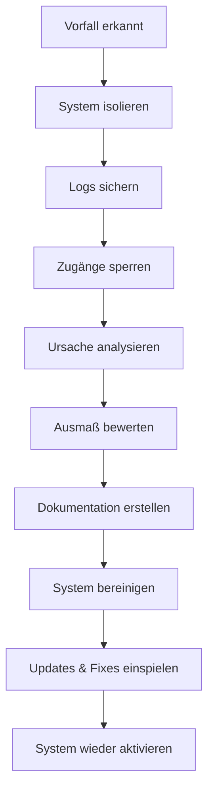

# Sicherheitsrichtlinien

Dieses Dokument beschreibt die Sicherheitsmaßnahmen und Best Practices für den Dateischutz.

## Ziele der Sicherheitsmaßnahmen

Die folgenden Maßnahmen dienen dem Schutz vor:

* Unbefugtem Zugriff auf geschützte Dateien
* Umgehung von Benutzerrollen und Zugriffsbeschränkungen
* Directory-Traversal-Angriffen und direktem Dateizugriff
* Missbrauch durch automatisierte Tools oder Massenzugriffe (DoS)
* Schwachstellen in der Anwendungsschicht (z. B. XSS, CSRF)
* Verstößen gegen Datenschutzrichtlinien (DSGVO)

## Sicherheitsarchitektur

### Mehrschichtige Sicherheit

1. **Dateisystem-Ebene**

   * Dateien außerhalb des Web-Roots
   * Strikte Berechtigungen
   * Keine direkte URL-Zugänglichkeit

2. **Webserver-Ebene**

   * `.htaccess`-Schutz
   * PHP-Ausführung verhindert
   * Weiterleitung an `check-access.php`

3. **Anwendungs-Ebene**

   * WordPress-Authentifizierung
   * Rollenbasierte Zugriffskontrolle
   * Session-Management
   * Schutz vor XSS (HTML-Ausgabe escapen)
   * CSRF-Schutz bei Formularen (z. B. Token-Verwendung)

4. **Transport-Ebene**

   * HTTPS-Verschlüsselung
   * Sichere Cookies
   * Chunked Downloads

## Sicherheitsmaßnahmen

### Dateisystem-Sicherheit

1. **Ordnerstruktur**

   ```
   /secure-files/              # Hauptordner (755)
   ├── config/                # Konfigurationsordner (755)
   │   └── secure-config.php  # Konfigurationsdatei (644)
   └── [role-folders]/        # Rollenordner (755)
   ```

2. **Berechtigungen**

   * Ordner: 755 (drwxr-xr-x)
   * Dateien: 644 (-rw-r--r--)
   * Ausführbare Dateien: 755 (-rwxr-xr-x)

3. **Schutzmaßnahmen**

   * Keine PHP-Ausführung
   * Keine Verzeichnisauflistung
   * Keine direkten Downloads

### Webserver-Sicherheit

1. **.htaccess-Regeln**

   ```apache
   # PHP-Ausführung verhindern
   <FilesMatch "\.php$">
       Order Allow,Deny
       Deny from all
   </FilesMatch>

   # Verzeichnisauflistung verhindern
   Options -Indexes

   # Weiterleitung an check-access.php
   RewriteEngine On
   RewriteCond %{REQUEST_FILENAME} -f
   RewriteRule ^(.*)$ check-access.php?file=$1 [L,QSA]
   ```

2. **PHP-Konfiguration**

   * `display_errors = Off`
   * `log_errors = On`
   * `error_reporting = E_ALL`

3. **Rate-Limiting und Abuse-Schutz (optional)**

   * IP-basiertes Request-Limit über Middleware oder Webserver (mod\_evasive, Nginx-Limits)
   * Zugriffszähler pro IP im Session-Kontext oder Redis

### Anwendungssicherheit

1. **Authentifizierung**

   * WordPress-Login erforderlich
   * Sichere Passwortrichtlinien
   * Session-Timeout

2. **Zugriffskontrolle**

   * Rollenbasierte Berechtigungen
   * Ordnerbasierte Einschränkungen
   * Keine Überschreitung der Rollengrenzen

3. **Datei-Handling**

   * MIME-Type-Validierung
   * Größenbeschränkungen
   * Chunked Downloads

### Datenschutz & Logging

* Keine Speicherung von IP-Adressen oder personenbezogenen Daten ohne Rechtsgrundlage
* Zugriffe auf Log-Dateien nur durch berechtigte Administratoren
* Löschung alter Logs automatisieren (z. B. nach 30 Tagen)

## Best Practices

### Konfiguration

1. **Sichere Einstellungen**

   ```php
   define('DEBUG_MODE', false);          // Debug-Modus deaktivieren
   define('CHUNK_SIZE', 4194304);        // 4 MB
   define('MAX_DIRECT_DOWNLOAD_SIZE', 1048576); // 1 MB
   ```

2. **MIME-Types**

   * Nur erlaubte Typen definieren
   * Keine ausführbaren Dateien (z. B. .php, .exe)
   * Dokumentierte und prüfbare Formate

### Wartung

1. **Regelmäßige Überprüfungen**

   * Berechtigungen prüfen
   * Logs analysieren
   * Updates einspielen

2. **Backup-Strategie**

   * Regelmäßige Backups
   * Verschlüsselte Speicherung
   * Getrennte Standorte

3. **Monitoring**

   * Zugriffsprotokolle
   * Fehlerprotokolle
   * Performance-Metriken

## Sicherheits-Checkliste

### Installation

* [ ] Ordner außerhalb des Web-Roots
* [ ] Korrekte Berechtigungen für Dateien und Verzeichnisse
* [ ] Keine ausführbaren Dateien im Download-Verzeichnis
* [ ] HTTPS vollständig eingerichtet
* [ ] Debug-Modus deaktiviert
* [ ] Zugriff nur über `check-access.php` möglich

### Konfiguration

* [ ] Benutzerrollen korrekt zugewiesen
* [ ] Zugriffsstruktur für Rollen definiert
* [ ] MIME-Types eingeschränkt auf sichere Formate
* [ ] Chunk-Größe sinnvoll konfiguriert
* [ ] Download-Limits gesetzt (Größe und Anzahl)
* [ ] Sicherheits-Header aktiv
* [ ] PHP-Fehlerausgabe deaktiviert

### Wartung

* [ ] Regelmäßige Updates von WordPress, PHP und Plugins
* [ ] Analyse und Rotation der Log-Dateien
* [ ] Berechtigungen regelmäßig überprüft
* [ ] Backup-Plan getestet und dokumentiert
* [ ] Monitoring aktiv (Fehler, Zugriffe, Performance)
* [ ] Alte Log-Dateien datenschutzkonform gelöscht

## Incident Response

### Bei Sicherheitsvorfällen

1. **Sofortmaßnahmen**

   * System isolieren
   * Logs sichern
   * Zugänge sperren

2. **Analyse**

   * Ursache identifizieren
   * Ausmaß bestimmen
   * Dokumentation erstellen

3. **Wiederherstellung**

   * System bereinigen
   * Updates einspielen
   * Zugänge neu konfigurieren

### Kontakt

Bei Sicherheitsvorfällen:

1. System-Administrator informieren
2. Logs bereitstellen
3. Vorfalldokumentation erstellen

### Incident-Ablauf (Diagramm)


