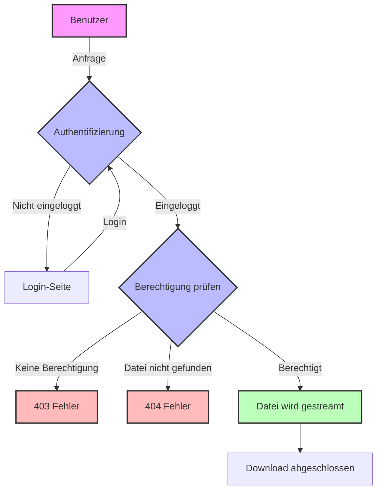

# Technische Dokumentation: Dateitresor

## Inhaltsverzeichnis

1. [Überblick](#überblick)
2. [Systemarchitektur](#systemarchitektur)
3. [Dateisystem-Struktur](#dateisystem-struktur)
4. [Technische Komponenten](#technische-komponenten)
5. [Sicherheitsmaßnahmen](#sicherheitsmaßnahmen)
6. [Performance-Optimierung](#performance-optimierung)
7. [Fehlerbehandlung](#fehlerbehandlung)
8. [Best Practices](#best-practices)

## Überblick

Der Dateitresor ist ein sicheres System zum Verwalten und Ausliefern geschützter Dateien in WordPress. Er ermöglicht:

- Sichere Speicherung von Dateien außerhalb des WebRoots
- Rollenbasierte Zugriffskontrolle
- Effizientes Streaming großer Dateien
- Schutz vor unbefugtem Zugriff

## Systemarchitektur

### Komponenten

1. **Dateisystem**
   - Geschützter Speicherort außerhalb des WebRoots
   - Rollenbasierte Ordnerstruktur
   - Konfigurationsdateien

2. **Webserver**
   - `.htaccess` für URL-Weiterleitung
   - PHP-Ausführung verhindert
   - Verzeichnisauflistung deaktiviert

3. **WordPress-Integration**
   - Authentifizierung
   - Rollenverwaltung
   - Pfadkonfiguration

## Dateisystem-Struktur

```
/secure-files/          # Hauptordner (außerhalb des WebRoots)
├── config/            # Konfigurationsordner (755)
│   └── secure-config.php  # Konfigurationsdatei (644)
└── [role-folders]/    # Rollenordner (755)
    └── [files]        # Geschützte Dateien (644)
```

### Berechtigungen

- Ordner: `755` (drwxr-xr-x)
- Dateien: `644` (-rw-r--r--)
- Konfigurationsdateien: `644` (-rw-r--r--)

## Technische Komponenten

### 1. .htaccess — URL-Weiterleitung

```apache
# PHP-Ausführung verhindern
<FilesMatch "\.php$">
    Order Allow,Deny
    Deny from all
</FilesMatch>

# Verzeichnisauflistung verhindern
Options -Indexes

# Weiterleitung an check-access.php
RewriteEngine On
RewriteCond %{REQUEST_FILENAME} -f
RewriteRule ^(.*)$ check-access.php?file=$1 [L,QSA]
```

### 2. check-access.php — Zugriffskontrolle

#### WordPress-Integration
```php
require_once dirname(__DIR__) . '/main/wp-load.php';
```
- Lädt WordPress-Umgebung
- Stellt Authentifizierung bereit
- Macht WordPress-Funktionen verfügbar

#### Pfad-Konstruktion
```php
$requested_file = $_GET['file'];
$secure_path = SECURE_FILE_PATH;
$full_path = $secure_path . '/' . $requested_file;
```
- Liest Dateipfad aus URL
- Verwendet WordPress-Konstante
- Konstruiert vollständigen Pfad

#### Zugriffskontrolle
```php
if (!is_user_logged_in()) {
    wp_redirect(wp_login_url($_SERVER['REQUEST_URI']));
    exit;
}
```
- Prüft Login-Status
- Leitet zum Login weiter
- Speichert Rückkehrpfad

#### Rollenprüfung
```php
$user = wp_get_current_user();
$role = $user->roles[0];
$role_folder = $role_folders[$role];
```
- Holt Benutzerinformationen
- Liest primäre Rolle
- Mappt auf Ordnerstruktur

#### Pfadvalidierung
```php
if (strpos($requested_file, $role_folder) !== 0) {
    wp_die('Zugriff verweigert');
}
```
- Prüft Rollenzugehörigkeit
- Verhindert Ordnerüberschreitung
- Gibt Fehlermeldung aus

#### MIME-Type-Erkennung
```php
$mime_type = mime_content_type($full_path);
if (!isset($allowed_mime_types[$mime_type])) {
    wp_die('Dateityp nicht erlaubt');
}
```
- Erkennt Dateityp
- Prüft Erlaubnis
- Verhindert Ausführung

#### Datei-Streaming
```php
header('Content-Type: ' . $mime_type);
header('Content-Length: ' . filesize($full_path));
readfile($full_path);
```
- Setzt Header
- Streamt Datei
- Optimiert Übertragung

#### Chunked Download
```php
$fp = fopen($full_path, 'rb');
while (!feof($fp)) {
    echo fread($fp, CHUNK_SIZE);
    flush();
}
fclose($fp);
```
- Öffnet Datei
- Liest in Chunks
- Verhindert Überlauf

## Sicherheitsmaßnahmen

### 1. Dateisystem
- Außerhalb des WebRoots
- Strikte Berechtigungen
- Keine PHP-Ausführung

### 2. Zugriffskontrolle
- WordPress-Login erforderlich
- Rollenbasierte Einschränkung
- Pfadvalidierung

### 3. Datei-Handling
- MIME-Type-Validierung
- Verzeichnistraversal-Schutz
- Größenbeschränkungen

## Performance-Optimierung

### 1. Chunked Downloads
- Optimale Chunk-Größe: 4 MB
- Sofortiges Flushing
- Speichereffizient

### 2. Caching
- Browser-Cache deaktiviert
- Server-Cache optimiert
- Session-Cache genutzt

### 3. Ressourcen
- Minimale PHP-Auslastung
- Effiziente Dateioperationen
- Optimierte Header

## Fehlerbehandlung

### 1. Zugriffsfehler
- 404: Datei nicht gefunden
- 403: Zugriff verweigert
- 401: Nicht eingeloggt

### 2. Systemfehler
- PHP-Fehler
- Dateisystem-Fehler
- Konfigurationsfehler

### 3. Benutzerfehler
- Falsche URLs
- Ungültige Rollen
- Fehlende Berechtigungen

## Best Practices

### 1. Installation
- Korrekte Ordnerstruktur
- Richtige Berechtigungen
- Sichere Konfiguration

### 2. Wartung
- Regelmäßige Updates
- Log-Analyse
- Backup-Strategie

### 3. Monitoring
- Zugriffsprotokolle
- Fehlerprotokolle
- Performance-Metriken

---

## Beispiel-Ablauf

### Prozessdiagramm



### Erklärung der Schritte

1. **Anfrage**
   - Benutzer fordert geschützte Datei an

2. **Authentifizierung**
   - Prüfung ob Benutzer eingeloggt ist
   - Bei nicht eingeloggten Benutzern: Weiterleitung zum Login

3. **Berechtigungsprüfung**
   - Prüfung der Benutzerrolle
   - Validierung des Dateipfads
   - Sicherheitsüberprüfungen

4. **Ergebnis**
   - Erfolg: Datei wird gestreamt
   - Fehler: 403 (keine Berechtigung) oder 404 (Datei nicht gefunden)

### Sicherheitsaspekte

- Keine direkte URL-Zugänglichkeit
- Rollenbasierte Zugriffskontrolle
- Pfadvalidierung gegen Directory Traversal
- Sichere Dateiübertragung
- Keine PHP-Ausführung in geschützten Verzeichnissen
