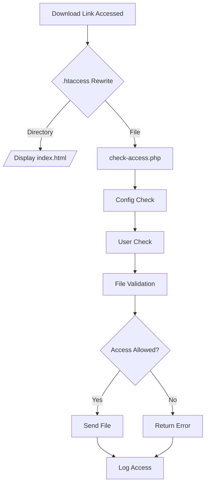
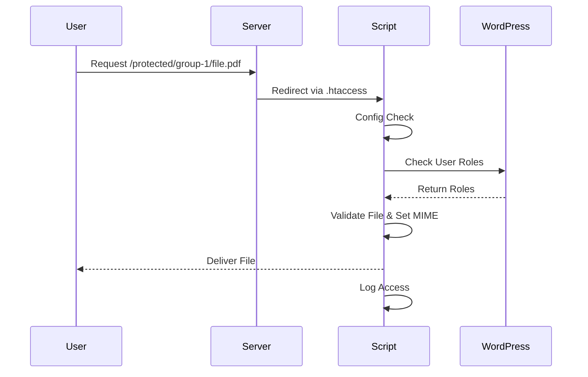

# Technical Documentation

This documentation is intended for developers or administrators who want to configure server-side, role-based access control for protected files using WordPress.

## System Architecture

### Directory Structure

```
secure-files/                  # Outside WebRoot (not publicly accessible)
├── config/
│   └── secure-config.php      # Configuration file
├── logs/
│   └── access.log             # Log file
├── group-1/
│   ├── example-1.pdf          # Files for users with "subscriber" role
│   └── ...
└── group-2/
    ├── example-2.pdf          # Files for users with "contributor" role
    └── ...
```

### Permissions

* `secure-files/`: 755 (drwxr-xr-x)
* `secure-files/config/`: 755 (drwxr-xr-x)
* `secure-files/logs/`: 755 (drwxr-xr-x)
* `secure-files/logs/access.log`: 644 (-rw-r--r--)
* `secure-files/group-*/*`: 644 (-rw-r--r--)

### Example URLs

* Access for Subscriber: `/protected/group-1/example-1.pdf`
* Access for Contributor: `/protected/group-2/example-2.pdf`

## Performance

### Download Optimization

* Direct downloads up to 1 MB
* Chunked downloads for larger files
* Chunk size: 4 MB
* No caching for protected files

## Maintenance

### Regular Tasks

* Review log files
* Check file permissions
* Test WordPress integration
* Validate security headers

### Backup

* Regular backups of `secure-files/` directory
* Backups of log files
* Backup of configuration file

### Updates

* Keep WordPress up to date
* Check PHP version
* Regularly update security headers
* Review MIME type settings

## Access Control Functionality

### .htaccess File

The `.htaccess` file manages access control using server-side rewrite rules.

**Protect access script**

```apache
RewriteRule ^check-access\.php$ - [F,L]
```

Prevents direct access to `check-access.php`.

**Directory Requests**

```apache
RewriteRule ^(.+/)$ /protected/check-access.php?file=$1index.html [QSA,L]
```

Automatically redirects directory requests to `index.html`.

**File Requests**

```apache
RewriteRule ^(.+)$ /protected/check-access.php?file=$1 [QSA,L]
```

All file requests are routed to `check-access.php`.

**Cache Control**

```apache
Header set Cache-Control "private, no-cache, no-store, must-revalidate"
```

Prevents browser caching; each request must be authorized.

### check-access.php

This script handles every request for a protected file:

1. **Initialization**

   * Loads the configuration file
   * Checks available memory limit
   * Integrates WordPress for role validation

2. **Authentication and Authorization**

   * Verifies user is logged in
   * Retrieves user roles
   * Validates access permission for the requested directory

3. **File Validation and Security**

   * Sanitizes file name to prevent traversal attacks
   * Checks file existence and size
   * Validates MIME type

4. **File Transfer**

   * Small files are sent directly
   * Large files are sent in chunks

5. **Logging**

   * Logs all requests
   * Rotates logs when maximum size is exceeded

### Detailed Function Overview

#### Configuration Check

```php
$config_file = dirname(dirname(__DIR__)) . '/secure-files/config/secure-config.php';
if (!file_exists($config_file)) {
    die('Error: Configuration file not found.');
}
require_once $config_file;
```

#### Memory Check

```php
$memory_limit = ini_get('memory_limit');
if (intval($memory_limit) < intval(MIN_MEMORY_LIMIT)) {
    die('PHP memory limit too low.');
}
```

#### WordPress Integration

```php
if (!file_exists(WP_CORE_PATH)) {
    die('Error: WordPress not found.');
}
require_once WP_CORE_PATH;
```

#### Debug Mode

```php
if (DEBUG_MODE) {
    error_reporting(E_ALL);
    ini_set('display_errors', 1);
}
```

#### Path Definition

```php
if (!defined('SECURE_FILE_PATH')) {
    define('SECURE_FILE_PATH', dirname(dirname(ABSPATH)) . '/secure-files');
}
```

#### Logging System

```php
if (!is_dir(LOG_DIR)) {
    if (!mkdir(LOG_DIR, 0755, true)) {
        die('Could not create log directory');
    }
}
if (!file_exists(LOG_FILE)) {
    if (!touch(LOG_FILE)) {
        die('Could not create log file');
    }
    chmod(LOG_FILE, 0644);
}
```

#### Log Rotation

```php
if (file_exists(LOG_FILE) && filesize(LOG_FILE) > LOG_MAX_SIZE) {
    $old_logs = glob(LOG_FILE . '.*');
    if (count($old_logs) >= LOG_MAX_FILES) {
        usort($old_logs, function($a, $b) {
            return filemtime($a) - filemtime($b);
        });
        unlink($old_logs[0]);
    }
    rename(LOG_FILE, LOG_FILE . '.' . date('Y-m-d-H-i-s'));
}
```

#### User Check

```php
$current = wp_get_current_user();
if (!is_user_logged_in()) {
    auth_redirect();
    exit;
}
```

#### File Name Validation

```php
$rel = $_GET['file'] ?? '';
$rel = ltrim(str_replace(['..', './', '\\'], '', $rel), '/');
if ($rel === '' || substr($rel, -1) === '/') {
    $rel .= 'index.html';
}
```

#### Security Check

```php
if (!preg_match('/^[a-zA-Z0-9._-]+\/[a-zA-Z0-9._-]+$/', $rel)) {
    status_header(400);
    exit('Invalid filename');
}
```

#### Role Check

```php
$roles = $current->roles;
$allowed = false;
foreach ($roles as $role) {
    if ($role === 'administrator') {
        $allowed = true;
        break;
    }
    if (isset($role_folders[$role])) {
        if (str_starts_with($rel, $role_folders[$role] . '/')) {
            $allowed = true;
            break;
        }
    }
}
```

#### File Validation

```php
$abs = realpath(SECURE_FILE_PATH . '/' . $rel);
if (
    $abs === false ||
    !is_file($abs) ||
    strncmp($abs, SECURE_FILE_PATH, strlen(SECURE_FILE_PATH)) !== 0
) {
    status_header(404);
    exit('not found');
}
```

#### File Size Check

```php
$size = filesize($abs);
if ($size === false || $size > MAX_FILE_SIZE) {
    status_header(413);
    exit('File too large');
}
```

#### MIME Type and Headers

```php
$ext = strtolower(pathinfo($abs, PATHINFO_EXTENSION));
$mime = $allowed_mime_types[$ext] ?? 'application/octet-stream';
header("Content-Type: $mime");
header('Cache-Control: ' . CACHE_CONTROL);
foreach (SECURITY_HEADERS as $header) {
    header($header);
}
header("Content-Length: $size");
```

#### File Delivery

```php
if ($size > MAX_DIRECT_DOWNLOAD_SIZE) {
    @set_time_limit(0);
    $fp = fopen($abs, 'rb');
    while (!feof($fp)) {
        $data = fread($fp, CHUNK_SIZE);
        echo $data;
        flush();
    }
    fclose($fp);
} else {
    readfile($abs);
}
```

### Typical Download Flow

1. A user accesses a download URL within the protected area.
2. `.htaccess` redirects the request to `check-access.php`.
3. The script validates configuration, login status, user role, file path, permissions, and MIME type.
4. If all checks pass, the file is delivered with appropriate headers.
5. Invalid requests are denied and logged.

### Flowchart



### Sequence Diagram



### Diagram Differences

The flowchart shows logical decision-making and conditions — ideal for understanding overall logic.

The sequence diagram visualizes the time-based flow between components — best for analyzing interfaces and interactions.

### MIME Types

The allowed MIME types are defined in `secure-config.php`. Here is an excerpt of the default configuration:

```php
$allowed_mime_types = [
    'pdf'  => 'application/pdf',
    'docx' => 'application/vnd.openxmlformats-officedocument.wordprocessingml.document',
    'xlsx' => 'application/vnd.openxmlformats-officedocument.spreadsheetml.sheet',
    'jpg'  => 'image/jpeg',
    'png'  => 'image/png'
];
```

Additional MIME types can be added in `secure-config.php`. A complete list of all possible MIME types can be found in the official IANA MIME types database.

### Error Handling

The system handles various error cases and returns appropriate HTTP status codes:

1. **400 Bad Request**
   - Invalid filename (contains forbidden characters)
   - Missing or invalid parameters
   - Cause: The file request contains invalid characters or is malformed
   - Solution: Check the URL and ensure only allowed characters are used

2. **403 Forbidden**
   - User is not logged in
   - User does not have the required role
   - File is in the wrong directory
   - Cause: Missing permissions
   - Solution: Check user role and directory structure

3. **404 Not Found**
   - File does not exist
   - File is outside the allowed directory
   - Cause: Incorrect file path or file was deleted
   - Solution: Verify the file path and directory structure

4. **413 Payload Too Large**
   - File exceeds maximum size limit
   - Cause: File is larger than `MAX_FILE_SIZE`
   - Solution: Reduce file size or increase the limit

5. **500 Internal Server Error**
   - Error reading the file
   - Error creating log directory
   - Error writing to log file
   - Cause: Server issues or missing permissions
   - Solution: Check server logs and permissions

### Debug Mode

The debug mode (`DEBUG_MODE`) enables additional functions for troubleshooting and development:

1. **Error Display**
   ```php
   if (DEBUG_MODE) {
       error_reporting(E_ALL);
       ini_set('display_errors', 1);
   }
   ```
   - Shows all PHP errors and warnings
   - Disables error suppression
   - Recommended for development environments only

2. **Enhanced Logging**
   - Logs all user roles
   - Stores detailed information about file access
   - Records chunked download status
   - Example log entries:
     ```
     Current roles: subscriber, contributor
     File transfer: group-1/example.pdf (application/pdf, 1048576 bytes)
     Chunk 1: 4194304 bytes transferred
     ```

3. **Performance Monitoring**
   - Measures transfer time
   - Counts number of chunks
   - Logs total size of transferred data

4. **Security Notes**
   - Debug mode should be disabled in production environments
   - It may expose sensitive information
   - It may impact performance

### Log Rotation

The system manages log files automatically:

1. **Size Limit**
   - Log files are rotated at 5 MB size
   - Maximum size is defined in `LOG_MAX_SIZE`
   - Example: `define('LOG_MAX_SIZE', 5242880); // 5 MB`

2. **Filenames**
   - Old log files are renamed with timestamp
   - Format: `access.log.YYYY-MM-DD-HH-mm-ss`
   - Example: `access.log.2024-03-20-14-30-00`

3. **Number of Log Files**
   - Maximum of 5 log files are kept
   - Oldest log file is automatically deleted
   - Configurable via `LOG_MAX_FILES`

4. **Rotation Process**
   ```php
   if (file_exists(LOG_FILE) && filesize(LOG_FILE) > LOG_MAX_SIZE) {
       $old_logs = glob(LOG_FILE . '.*');
       if (count($old_logs) >= LOG_MAX_FILES) {
           usort($old_logs, function($a, $b) {
               return filemtime($a) - filemtime($b);
           });
           unlink($old_logs[0]);
       }
       rename(LOG_FILE, LOG_FILE . '.' . date('Y-m-d-H-i-s'));
   }
   ```

### Security Aspects

The system implements several security measures:

1. **Filename Validation**
   ```php
   if (!preg_match('/^[a-zA-Z0-9._-]+\/[a-zA-Z0-9._-]+$/', $rel)) {
       status_header(400);
       exit('Invalid filename');
   }
   ```
   - Prevents directory traversal attacks
   - Allows only safe characters
   - Blocks path manipulations

2. **Security Headers**
   ```php
   define('SECURITY_HEADERS', [
       'X-Content-Type-Options: nosniff',
       'X-Frame-Options: DENY',
       'X-XSS-Protection: 1; mode=block',
       'Referrer-Policy: strict-origin-when-cross-origin',
       'Content-Security-Policy: default-src \'self\'',
       'Strict-Transport-Security: max-age=31536000; includeSubDomains'
   ]);
   ```
   - Prevents MIME type sniffing
   - Blocks clickjacking
   - Enables XSS protection
   - Controls referrer information
   - Enforces HTTPS

3. **Cache Control**
   ```php
   define('CACHE_CONTROL', 'private, no-cache, no-store, must-revalidate');
   ```
   - Prevents file caching
   - Enforces new authorization for each access
   - Protects against outdated file versions

4. **MIME Type Validation**
   - Checks file type before download
   - Prevents script execution
   - Restricts to allowed file types

5. **Permission Check**
   - Verifies user role
   - Checks directory permissions
   - Prevents unauthorized access

6. **Logging and Monitoring**
   - Logs all access attempts
   - Stores errors and warnings
   - Enables tracking of security incidents