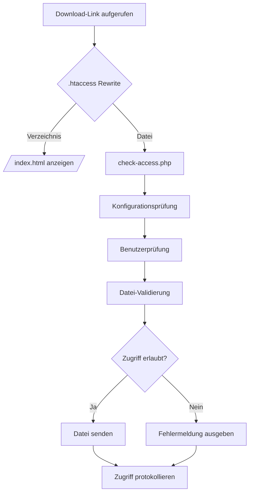
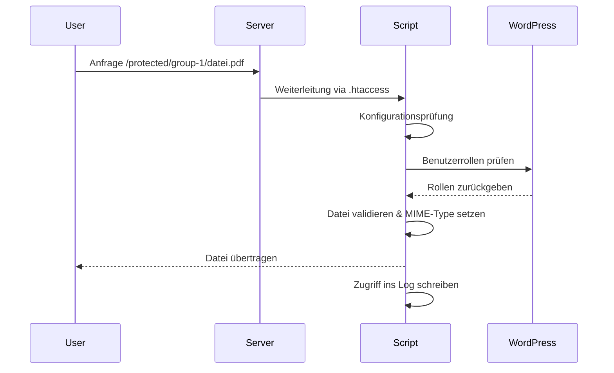

# Technische Dokumentation

Diese Dokumentation richtet sich an Entwickler\:innen oder Administrator\:innen, die die Zugriffskontrolle auf geschützte Dateien serverseitig und rollenbasiert mit WordPress konfigurieren möchten.

## Systemarchitektur

### Verzeichnisstruktur

```
secure-files/                  # Außerhalb des WebRoots (nicht erreichbar)
├── config/
│   └── secure-config.php      # Konfigurationsdatei
├── logs/
│   └── access.log             # Log-Datei
├── group-1/
│   ├── example-1.pdf          # Dateien für Benutzer mit Rolle "subscriber"
│   └── ...
└── group-2/
    ├── example-2.pdf          # Dateien für Benutzer mit Rolle "contributor"
    └── ...
```

### Berechtigungen

* `secure-files/`: 755 (drwxr-xr-x)
* `secure-files/config/`: 755 (drwxr-xr-x)
* `secure-files/logs/`: 755 (drwxr-xr-x)
* `secure-files/logs/access.log`: 644 (-rw-r--r--)
* `secure-files/group-*/*`: 644 (-rw-r--r--)

### Beispiel-URLs

* Zugriff für Subscriber: `/protected/group-1/example-1.pdf`
* Zugriff für Contributor: `/protected/group-2/example-2.pdf`

## Performance

### Download-Optimierung

* Direkte Downloads bis zu 1 MB
* Chunked Downloads für größere Dateien
* Chunk-Größe: 4 MB
* Kein Caching für geschützte Dateien

## Wartung

### Regelmäßige Aufgaben

* Log-Dateien überprüfen
* Dateiberechtigungen prüfen
* Integration mit WordPress testen
* Sicherheits-Header validieren

### Backup

* Regelmäßige Backups des Verzeichnisses `secure-files/`
* Backups der Log-Dateien
* Backup der Konfigurationsdatei

### Updates

* WordPress aktualisieren
* PHP-Version prüfen
* Sicherheits-Header regelmäßig aktualisieren
* MIME-Typen-Einstellungen überprüfen

## Funktionsweise der Zugriffskontrolle

### .htaccess-Datei

Die `.htaccess`-Datei steuert die Zugriffskontrolle über serverseitige Rewrite-Regeln.

**Schutz des Zugriffsskripts**

```apache
RewriteRule ^check-access\.php$ - [F,L]
```

Verhindert den direkten Aufruf von `check-access.php`.

**Verzeichnisanfragen**

```apache
RewriteRule ^(.+/)$ /protected/check-access.php?file=$1index.html [QSA,L]
```

Leitet Verzeichnisanfragen automatisch zur jeweiligen `index.html` weiter.

**Dateianfragen**

```apache
RewriteRule ^(.+)$ /protected/check-access.php?file=$1 [QSA,L]
```

Alle Dateianfragen werden an `check-access.php` übergeben.

**Cache-Kontrolle**

```apache
Header set Cache-Control "private, no-cache, no-store, must-revalidate"
```

Verhindert die Zwischenspeicherung im Browser. Jeder Zugriff muss neu autorisiert werden.

### check-access.php

Dieses Skript prüft und verarbeitet jede eingehende Anfrage auf eine geschützte Datei:

1. **Initialisierung**

   * Lädt die Konfigurationsdatei
   * Prüft das verfügbare Memory-Limit
   * Integriert WordPress zur Rollenprüfung

2. **Authentifizierung und Autorisierung**

   * Überprüft, ob ein Benutzer angemeldet ist
   * Ermittelt die Benutzerrollen
   * Validiert die Zugriffsberechtigung auf das angeforderte Verzeichnis

3. **Dateiprüfung und Sicherheit**

   * Bereinigt Dateinamen und verhindert Traversal-Angriffe
   * Prüft Dateigröße und Existenz
   * Validiert den MIME-Typ

4. **Dateiversand**

   * Kleine Dateien werden direkt übertragen
   * Große Dateien werden blockweise (chunked) übertragen

5. **Protokollierung**

   * Dokumentiert alle Anfragen im Log
   * Rotiert Log-Dateien bei Überschreitung der Maximalgröße

### Detaillierte Funktionsbeschreibung

#### Konfigurationsprüfung

```php
$config_file = dirname(dirname(__DIR__)) . '/secure-files/config/secure-config.php';
if (!file_exists($config_file)) {
    die('Fehler: Konfigurationsdatei nicht gefunden.');
}
require_once $config_file;
```

Lädt die Konfigurationsdatei und bricht ab, wenn sie fehlt.

#### Speicherprüfung

```php
$memory_limit = ini_get('memory_limit');
if (intval($memory_limit) < intval(MIN_MEMORY_LIMIT)) {
    die('PHP Memory-Limit zu niedrig.');
}
```

Stellt sicher, dass ausreichend Arbeitsspeicher zur Verfügung steht.

#### WordPress-Integration

```php
if (!file_exists(WP_CORE_PATH)) {
    die('Fehler: WordPress nicht gefunden.');
}
require_once WP_CORE_PATH;
```

Lädt WordPress zur Benutzerprüfung.

#### Debug-Modus

```php
if (DEBUG_MODE) {
    error_reporting(E_ALL);
    ini_set('display_errors', 1);
}
```

Aktiviert detaillierte Fehlermeldungen im Entwicklungsmodus.

#### Pfaddefinition

```php
if (!defined('SECURE_FILE_PATH')) {
    define('SECURE_FILE_PATH', dirname(dirname(ABSPATH)) . '/secure-files');
}
```

Definiert den Pfad zum Verzeichnis mit geschützten Dateien.

#### Logging-System

```php
if (!is_dir(LOG_DIR)) {
    if (!mkdir(LOG_DIR, 0755, true)) {
        die('Log-Verzeichnis konnte nicht erstellt werden');
    }
}
if (!file_exists(LOG_FILE)) {
    if (!touch(LOG_FILE)) {
        die('Log-Datei konnte nicht erstellt werden');
    }
    chmod(LOG_FILE, 0644);
}
```

Stellt sicher, dass das Log-Verzeichnis und die Log-Datei existieren.

#### Log-Rotation

```php
if (file_exists(LOG_FILE) && filesize(LOG_FILE) > LOG_MAX_SIZE) {
    $old_logs = glob(LOG_FILE . '.*');
    if (count($old_logs) >= LOG_MAX_FILES) {
        usort($old_logs, function($a, $b) {
            return filemtime($a) - filemtime($b);
        });
        unlink($old_logs[0]);
    }
    rename(LOG_FILE, LOG_FILE . '.' . date('Y-m-d-H-i-s'));
}
```

Rotiert alte Log-Dateien bei Überschreitung der Maximalgröße.

#### Benutzerprüfung

```php
$current = wp_get_current_user();
if (!is_user_logged_in()) {
    auth_redirect();
    exit;
}
```

Nur angemeldete Benutzer dürfen auf Dateien zugreifen.

#### Dateinamen-Validierung

```php
$rel = $_GET['file'] ?? '';
$rel = ltrim(str_replace(['..', './', '\'], '', $rel), '/');
if ($rel === '' || substr($rel, -1) === '/') {
    $rel .= 'index.html';
}
```

Bereinigt gefährliche Zeichen im Pfad und behandelt Verzeichnisaufrufe.

#### Sicherheitsprüfung

```php
if (!preg_match('/^[a-zA-Z0-9._-]+\/[a-zA-Z0-9._-]+$/', $rel)) {
    status_header(400);
    exit('Invalid filename');
}
```

Verhindert Zugriffe auf unsichere Dateipfade.

#### Rollenprüfung

```php
$roles = $current->roles;
$allowed = false;
foreach ($roles as $role) {
    if ($role === 'administrator') {
        $allowed = true;
        break;
    }
    if (isset($role_folders[$role])) {
        if (str_starts_with($rel, $role_folders[$role] . '/')) {
            $allowed = true;
            break;
        }
    }
}
```

Erlaubt Zugriff, wenn der Benutzer die passende Rolle für das Zielverzeichnis hat.

#### Dateiprüfung

```php
$abs = realpath(SECURE_FILE_PATH . '/' . $rel);
if (
    $abs === false ||
    !is_file($abs) ||
    strncmp($abs, SECURE_FILE_PATH, strlen(SECURE_FILE_PATH)) !== 0
) {
    status_header(404);
    exit('not found');
}
```

Prüft, ob die Datei existiert und im zulässigen Verzeichnis liegt.

#### Dateigrößenprüfung

```php
$size = filesize($abs);
if ($size === false || $size > MAX_FILE_SIZE) {
    status_header(413);
    exit('File too large');
}
```

Blockiert den Zugriff auf zu große Dateien.

#### MIME-Type und Header

```php
$ext = strtolower(pathinfo($abs, PATHINFO_EXTENSION));
$mime = $allowed_mime_types[$ext] ?? 'application/octet-stream';
header("Content-Type: $mime");
header('Cache-Control: ' . CACHE_CONTROL);
foreach (SECURITY_HEADERS as $header) {
    header($header);
}
header("Content-Length: $size");
```

Setzt den korrekten MIME-Type und alle notwendigen Sicherheits-Header.

#### Dateiübertragung

```php
if ($size > MAX_DIRECT_DOWNLOAD_SIZE) {
    @set_time_limit(0);
    $fp = fopen($abs, 'rb');
    while (!feof($fp)) {
        $data = fread($fp, CHUNK_SIZE);
        echo $data;
        flush();
    }
    fclose($fp);
} else {
    readfile($abs);
}
```

Verwendet Chunked-Download für große Dateien und direkten Transfer für kleine Dateien.

### Typischer Ablauf eines Downloads

1. Ein Benutzer ruft eine Download-URL im geschützten Bereich auf.
2. Die `.htaccess`-Datei leitet die Anfrage an `check-access.php` weiter.
3. Das Skript prüft Konfiguration, Login-Status, Benutzerrolle, Dateipfad, Berechtigungen und Dateityp.
4. Falls alle Bedingungen erfüllt sind, wird die Datei mit entsprechenden Headern übertragen.
5. Fehlerhafte Anfragen werden abgewiesen und im Log erfasst.

### Ablaufdiagramm

Das Ablaufdiagramm zeigt die logische Entscheidungskette vom Aufruf einer Datei bis zur Zugriffskontrolle. Es visualisiert, welche Prüfungen in welcher Reihenfolge erfolgen und ob der Zugriff erlaubt oder verweigert wird.



### Sequenzdiagramm



Das Sequenzdiagramm veranschaulicht den zeitlichen Ablauf der Kommunikation zwischen den beteiligten Komponenten – Benutzer, Webserver, Zugriffsskript und WordPress. Es macht sichtbar, wie Anfragen weitergereicht und geprüft werden, bevor eine Datei ausgeliefert wird.

### Unterschied der Diagramme

Das Ablaufdiagramm stellt logische Entscheidungswege und Bedingungen dar – ideal zur Übersicht über die Funktionslogik.

Das Sequenzdiagramm dagegen zeigt die zeitliche Abfolge von Nachrichten und Interaktionen zwischen den beteiligten Komponenten – es eignet sich besonders zur Analyse von Schnittstellen und Kommunikationsflüssen.
